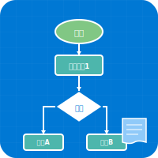
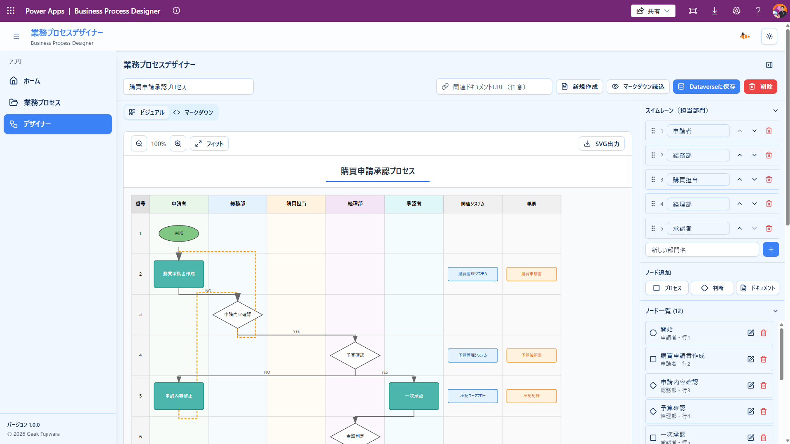

# 業務プロセスデザイナー (Business Process Designer)

<div align="center">
  
  
  **業務プロセスを視覚的に設計・管理できるWebアプリケーション**
  
  [](https://opensource.org/licenses/MIT)
  [](https://learn.microsoft.com/power-apps/)
</div>

---

## 📖 概要

**業務プロセスデザイナー**は、組織の業務フローを視覚的に設計・文書化・共有できるWebアプリケーションです。部門ごとに整理されたSwimlane（スイムレーン）ダイアグラムで、業務の流れを直感的に理解できます。

### このアプリケーションでできること

- 📊 **視覚的なプロセス設計**: ドラッグ&ドロップで業務フローを作成
- 🤖 **AI支援**: M365 Copilotで業務マニュアルから自動生成
- 💾 **安全なデータ管理**: Dataverseで組織データを一元管理
- 📝 **柔軟な編集**: ビジュアルとマークダウンの両方で編集可能
- 🔄 **バージョン管理**: 変更履歴を自動記録
- 👥 **チーム共有**: Power Platformで組織内共有

### 利用シーン

- 業務フローの標準化・文書化
- 内部統制・コンプライアンス対応
- 新入社員向けの業務手順書作成
- 業務改善プロジェクトの可視化
- ISO認証取得のプロセス文書化

---

## � デモ動画とスクリーンショット

### アプリケーション画面

<div align="center">
  
</div>

### デモ動画

#### 基本的な使い方

https://github.com/geekfujiwara/BusinessProcessDesigner/assets/96101315/demo-basic.mp4

M365 Copilotとの連携や基本的な編集機能のデモです。

#### ドキュメントからフローを生成

https://github.com/geekfujiwara/BusinessProcessDesigner/assets/96101315/demo-document-to-flow.mp4

業務マニュアルからM365 Copilotで自動的に業務プロセスを生成する方法を紹介します。

---

## �🎯 前提条件

このアプリケーションを利用するには、以下が必要です：

### 1. Power Apps Premium ライセンス

業務プロセスデザイナーは**Power Apps Code Apps**として開発されており、実行には**Power Apps Premium**または**Power Apps per app**ライセンスが必要です。

#### ライセンスについて詳しく知る

- 📘 [Power Platform ライセンスガイド（英語）](https://aka.ms/pplic)
- 📘 [Power Platform ライセンスガイド（日本語）](https://aka.ms/pplicjp)
- 💡 [Power Apps のライセンス概要](https://learn.microsoft.com/ja-jp/power-platform/admin/pricing-billing-skus)

#### ライセンスの種類

| ライセンス | 説明 | 推奨用途 |
|-----------|------|---------|
| **Power Apps Premium** | ユーザーごとのライセンス。すべてのPower Appsアプリを無制限に利用可能 | 複数のアプリを日常的に使用する組織 |
| **Power Apps per app** | アプリごとのライセンス。特定の1つのアプリのみ利用可能 | このアプリだけを使いたい場合 |

> **💡 ヒント**: 組織でPower Apps Premiumライセンスをお持ちでない場合は、管理者にライセンスの割り当てを依頼してください。

### 2. Dataverse環境

このアプリは**Dataverse**（旧Common Data Service）を使用してデータを保存します。Dataverse環境が作成されていない場合は、Power Platform管理センターから作成できます。

- [Dataverseについて学ぶ](https://learn.microsoft.com/ja-jp/power-apps/maker/data-platform/data-platform-intro)
- [環境の作成方法](https://learn.microsoft.com/ja-jp/power-platform/admin/create-environment)

### 3. オプション: M365 Copilot

業務マニュアルからAIで自動生成する機能を使用する場合は、**Microsoft 365 Copilot**ライセンスが必要です（オプション）。

---

## 🚀 インストール方法

### ステップ1: ソリューションのダウンロード

1. GitHubの[Releases](https://github.com/geekfujiwara/BusinessProcessDesigner/releases)ページにアクセス
2. 最新バージョンのソリューションファイル（`.zip`）をダウンロード

### ステップ2: Power Appsへのインポート

1. [Power Apps](https://make.powerapps.com/)にアクセス
2. 左側のメニューから**ソリューション**を選択
3. 上部の**インポート**をクリック
4. ダウンロードしたソリューションファイルを選択してインポート
5. インポートが完了したら、ソリューション内のアプリを開いて利用開始

> **📖 詳しい手順**: [ソリューションのインポート方法（Microsoft公式ドキュメント）](https://learn.microsoft.com/ja-jp/power-apps/maker/data-platform/import-update-export-solutions)

---

## 📱 使い方

### 1️⃣ プロセスの作成

#### 方法A: M365 Copilotで自動生成（推奨）

1. ホーム画面で「**M365 Copilotでプロセスを作成**」を選択
2. 表示されるプロンプトをコピー
3. M365 Copilotに業務マニュアル（Word、PDF等）を添付
4. コピーしたプロンプトを送信
5. 生成されたマークダウンをコピーしてアプリにインポート

#### 方法B: 手動で作成

1. 「**プロセスエディタ**」を開く
2. 「**新規作成**」ボタンをクリック
3. サイドパネルで**部門（スイムレーン）**を追加
4. **プロセスノード**を追加してフローを構築
5. 必要に応じて**システム**や**帳票**を関連付け

### 2️⃣ プロセスの編集

- **ビジュアルタブ**: Swimlaneダイアグラムで視覚的に編集
- **マークダウンタブ**: テキストで直接編集
- サイドパネルで各要素の詳細を管理

### 3️⃣ 保存と共有

- 「**Dataverseに保存**」でクラウドに保存
- 変更履歴が自動的に記録されます
- 組織内の他のユーザーとプロセスを共有可能

---

## 💻 開発者向け情報

このアプリケーションをカスタマイズしたい開発者向けの情報です。

### 技術スタック

- **フロントエンド**: React 18 + TypeScript + Vite
- **UI**: Tailwind CSS + shadcn/ui
- **状態管理**: Zustand
- **データ取得**: TanStack Query
- **バックエンド**: Power Platform Dataverse

### ローカル開発環境のセットアップ

#### 前提条件
- Node.js 18以上
- Power Apps CLI
- Git

#### セットアップ手順

```powershell
# リポジトリをクローン
git clone https://github.com/geekfujiwara/BusinessProcessDesigner.git
cd BusinessProcessEditer

# 依存関係をインストール
npm install

# 開発サーバーを起動
npm run dev
```

#### Power Apps環境との接続

```powershell
# Power Apps環境を初期化
pac code init -n "Business Process Designer" -env <環境ID>

# Dataverseテーブルを接続
pac code add-data-source -a "dataverse" -t "geek_businessprocesses"
```

#### ビルドとデプロイ

```powershell
# プロダクションビルド
npm run build

# Power Appsにプッシュ
pac code push
```

### プロジェクト構成

```
BusinessProcessEditer/
├── src/
│   ├── components/
│   │   ├── business-process/    # プロセスエディタコンポーネント
│   │   │   ├── swimlane-diagram.tsx
│   │   │   ├── markdown-parser.ts
│   │   │   └── nodes/           # ノード型コンポーネント
│   │   └── ui/                  # UIコンポーネント
│   ├── pages/
│   │   ├── process-list.tsx     # プロセス一覧
│   │   └── process-editor.tsx   # プロセスエディタ
│   ├── stores/
│   │   └── flowchart-store.ts   # 状態管理
│   └── generated/               # Power SDK自動生成
├── dataverse-tables/            # Dataverseテーブル定義
└── public/
    └── app-icon.svg             # アプリアイコン
```

---

## ❓ よくある質問（FAQ）

### Q1: ライセンスは必ず必要ですか？

**A**: はい、このアプリは**Power Apps Premium**または**Power Apps per app**ライセンスが必要です。これはDataverseを使用するすべてのPower Appsアプリに共通の要件です。

### Q2: 無料で試すことはできますか？

**A**: [Power Apps開発者プラン](https://powerapps.microsoft.com/ja-jp/developerplan/)を利用すると、個人の学習・開発目的で無料でPower Appsを試せます。

### Q3: M365 Copilotは必須ですか？

**A**: いいえ、オプションです。M365 Copilotがなくても手動でプロセスを作成できます。Copilotを使うと業務マニュアルから自動生成できて便利です。

### Q4: 既存の業務フロー図をインポートできますか？

**A**: はい、マークダウン形式で記述されていればインポート可能です。詳細は開発者向けドキュメントを参照してください。

### Q5: データはどこに保存されますか？

**A**: すべてのデータは組織のDataverse環境に安全に保存されます。Microsoft のセキュリティ基準に準拠しています。

---

## 🤝 サポート・コントリビューション

### 問題を報告する

バグや機能要望がある場合は、[GitHub Issues](https://github.com/geekfujiwara/BusinessProcessDesigner/issues)で報告してください。

### コントリビューション

プルリクエストを歓迎します！大きな変更の場合は、まずissueで議論してください。

---

## 📄 ライセンス

MIT License - 詳細は[LICENSE](LICENSE)ファイルを参照してください。

---

## 👨‍💻 作成者

### Geek Fujiwara

Power Platform と Microsoft 365 の技術情報を発信しています。

- 🐦 X (Twitter): [@geekfujiwara](https://x.com/geekfujiwara)
- 📺 YouTube: [Geek Fujiwara チャンネル](https://www.youtube.com/@geekfujiwara)
- 📚 Udemy: [Power Platform コース](https://www.udemy.com/user/gikuhuziwarateng-yuan-hong-dao/)
- 📝 ブログ: [geekfujiwara.com](https://www.geekfujiwara.com/)

---

## 🙏 謝辞

このアプリケーションは、Microsoft の [Power Apps Code Apps](https://github.com/microsoft/PowerAppsCodeApps) 技術を使用して開発されています。

---

<div align="center">
  <p>⭐ このプロジェクトが役に立ったら、GitHubでスターをお願いします！</p>
</div>
